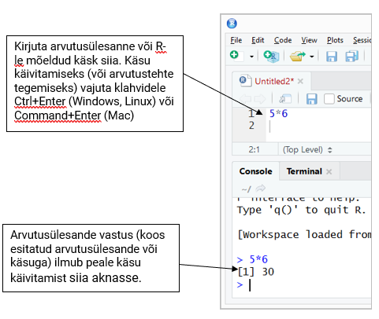
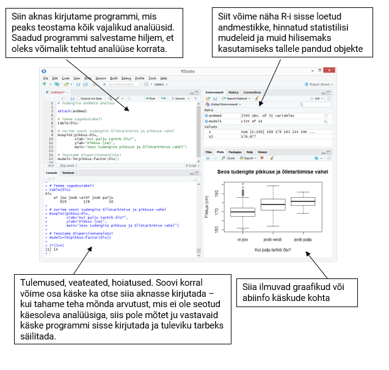

 
```{r setup, cache=FALSE, include=FALSE}
knitr::opts_chunk$set(collapse = FALSE)

hook1 <- function(x){ gsub("```\n*```r*\n*", "", x) }
hook2 <- function(x){ gsub("```\n+```\n", "", x) }
#knitr::knit_hooks$set(document = hook2)

```


# RStudio ja kasutajaliides

Leia oma arvutis programm RStudio, kui sa pole seda veel paigaldanud, siis saad selle tasuta alla laadida [RStudio kodulehelt](https://rstudio.com/products/rstudio/download/#download).

 **NB!** RStudio pole ainus R-i kasutajaliides, on veel palju teisi aga pidime valima ühe aga pea kõik kursusel käsitletav on tehtav igas teises R-i kasutajaliideses.



Teeme tutvust RStudio-ga:

* Avanenud programmiaken jaguneb üldiselt neljaks. Akende paigutust saab oma suva järgi muuta, kuid esialgu paiknevad paremal aknad, mis annavad ülevaate kasutatavatest kaustadest, defineeritud muutujatest, graafikutest jne ning vasakul on R-i konsool ja tekstiredaktor käskude kirjapanekuks;
* R konsool
    - alumine vasakpoolne aken on programmi R konsooliaknen, kuhu saab programmi käsud kirjutada viiba `>` järele;
    -	käsk täidetakse pärast `Enter`-klahvi vajutamist;
    -	varem sisestatud käske saab tagasi sirvida nooleklahviga $\uparrow$;
    -	plussmärk `+` rea ees näitab, et käsk on pooleli.
* Tekstiredaktor
    - tekstiredaktorisse saate kirjutada R-i käsud/koodi ja kommentaarid;
    - käsufaili ühel real peab olema kirjutatud üks käsk (reavahetus näitab programmile käsu lõppu), kui soovid ühele reale kirjutada mitu käsku, siis need tuleb eraldada semikooloniga `;`
    - kommentaari lisamiseks tuleb vastava rea algusess lisada `#`-märk;
    - mingi koodilõigu käivitamiseks tuleb see hiirega ära valida ning vajutada klahvikombinatsiooni `Ctrl+Enter`.



Konsooli käskude sisestamise asemel on neid mõistlik kirjutada skriptifaili, et hiljem (nt järgmisel päeval) saaks tehtud tööd (näiteks mingi analüüsi) kiiresti jätkata või uuesti teha kui on lisandunud uued andmed. Skriptifaili tekitamiseks R-is tuleks valida menüüst `File` valik `New script`. Avatakse skriptiaken, kuhu saab käske kirjutada. Kui skriptiaknas olles vajutada klahve `Ctrl+Enter`, siis vastaval real olev käsk saadetakse R-ile täitmiseks. Kui käsk on kirjutatud mitmel real või on soov mitut käsku järjest jooksutada, võib vastavad read skriptiaknas hiirega ära märkida ning seejärel `Ctrl+Enter` vajutada. Valides menüüst `File` valiku `Save`, salvestatakse `.R` lõpuga skriptifail kasutaja poolt määratud asukohta.

Sriptiaknas on mõislik käskudele lisada kommentaare, et teinekord (või teisel inimesel) oleks koodi lihtsam lugeda. **Kommentaare** saab R-i koodis lisada ainult rea lõppu, kasutades trellide-sümbolit:

```{r funktsTest, eval=TRUE, exercise = TRUE}
log(5.9)  # võtame naturaallogaritmi arvust 5,9
# terve see rida on kommentaar, sest rea alguses on # ehk trellide sümbol
```

Pane tähele, et **kümnendmurru eraldamiseks** kasutatakse R-is punkti, mitte koma.


## Käsud ja abi saamine

Ülalolevad aritmeetikaavaldised `sqrt(9)`, `runif(4, 0, 1)` jne on tegelikult **käsud** ehk **funktsioonid**, mis oskavad teatud asju teha (praeguses näites teatud arvutusi teha). Kõigil käskudel on sarnane süntaks:

`käsk(argumendid)`

Üldiselt on käsu argumentidel ka nimed, näiteks käsk `runif` tahab täpselt kahte argumenti: `n`, `min` ja `max`. Mõnikord on kasulik argumentide nimed välja kirjutada, et hiljem koodi üle lugedes oleks aru saada, mida miski tähendab:
```{r,eval=FALSE}
runif(n = 4, min = 0, max = 1)
```

Osadel käskudel on mõnedele argumentidele antud  niinimetatud vaikimisi väärtused. Neid argumente ei pea (aga võib) käsu kasutamisel välja kirjutama kui vaikimisi argument on parajasti sobiv väärtus. Näiteks on käsul `log` vaikimisi määratud argumendi `base` ehk logaritmi aluse väärtus arvuga $e \approx 2.718282$ st käsk arvutab naturaallogaritmi. Kui on soov leida naturaallogaritmi arvust 8, siis võib käsu kirja panna  `log(8)`, kui aga on vaja leida arvu 8 logaritmi baasil 2, siis tuleks argumendi `base` vaikimisi väärtust muuta, ehk
```{r}
log(8, base = 2)
```

Kui mingi konkreetse käsu kohta soovitakse abi saada (näiteks kontrollida, mis on käsu argumentide nimed ja millises järjekorras need tuleks ette anda), võib abi otsida RStudio abiaknast (paremal all, `Help` vahelehel). Lisaks võib otsida ka märksõnu ja RStudio pakub välja käskusid, mis sellele märksõnale vastavad (**NB!** käsud esitatakse stiilis `<pakett>::<käsk>`, nt `dplyr::select`. Pakettideni jõuame hiljem).
 

Tasub tähele panna, et R on (nagu suurem osa programmeerimiskeeli) **tõstutundlik** -- see tähendab, et programm eristab suuri ja väikeseid tähti. Kui ajada käsu või argumendi nimes mõni suur- ja väiketäht segi, siis on tulemuseks veateade:
```{r,error=TRUE}
Log(5)
log(8, BASE = 2)
```


### Ülesanded

1. Uuri välja, kuidas töötab käsk `sample`. Mis on selle argumendid?
1. Uuri välja, mida teeb käsk `rnorm`.
1. Leia funktsioon, mis arvutaks kumulatiivse summa.


# Lisapakettide kasutamine

Üks R-i populaarseks muutumise põhjuseid on rikkalik lisapakkettide olemasolu. Tõenäoliselt leidub iga praktilise statistika-alase (ja ka mõne muu valdkonna) probleemi jaoks omaette pakett (*package*). Siinkohal vaatame aga jooniste tegemise paketi `ggplot2`.

Lisapaketid ei ole tavaliselt R-iga kaasas, vaid need tuleb paigaldada. Kui paigaldatav pakett vajab omakorda mingeid muid pakette, siis paigaldatakse ka need.

Paigaldame lisapaketi `ggplot2` ja talle vajalikud paketid (**NB!** jutumärgid):
```{r, eval=FALSE}
install.packages("ggplot2")
```

Kui pakett on paigaldatud, siis järgmisel töösessioonil seda enam uuesti paigaldama ei pea. Küll aga tuleb arvutisse paigaldatud paketid igal uuel R-i sessioonil sisse laadida käsuga `library` (või `require`), mille argumendiks on laaditava paketi nimi:
```{r, eval = FALSE, warning=FALSE}
library(ggplot2)
```


# Muutujatega töötamine

## Väärtuste omistamine ja töökeskkond (*environment*)
Sageli on mugav, kui töös kasutatavatele muutujatele nimi anda -- siis saame neid edaspidi nimepidi kutsuda. Näiteks kui nimetada `kaal <- 70`  ja  `pikkus <- 185` ehk konsoolil
```{r}
kaal <- 70
pikkus <- 185
```
siis saaks kehamassiindeksit arvutada nii:
```{r}
kaal / (pikkus / 100)**2
```

Tekitasime  esimesel sammul töökeskkonda kaks objekti, mille nimed on `kaal` ja `pikkus`. Täpsemini: tekitasime objektid `kaal` ja `pikkus`, millele omistasime väärtused 70 ja 185. Sümboliühendit `<-` nimetatakse omistamisoperaatoriks. Üldjuhul töötab omistamisoperaatorina ka võrdusmärk `=`, ent on mõned erandjuhtumid, kus need erinevalt töötavad; lisaks on võrdusmärk kasutusel käskude argumentidele väärtuse andmisel.

Kui nüüd muuta `kaal` väärtust: `kaal <- 90` `r kaal <- 90`, siis konsoolis ülesnoolega üle-eelmise käsu (KMI arvutamise) üles otsides saab seda lihtsasti uuesti jooksutada.
```{r}
kaal / (pikkus / 100)**2
```

Siit maksab tähele panna ka seda, et muutujale uut väärtust omistades kirjutatakse vana lihtsalt üle, mingit hoiatust R ei anna.

Töökeskkonnas olevatest objektidest saab ülevaate aknast `Environment` (paremal üleval).


## Vektorid. Tehted vektoritega

Eelmises punktis vaatasime juhtu, muutujate väärtuseks oli üks arv. Objekti võib aga moodustada ka mitmest väärtusest, näiteks omistame kuue uuritava kaalud muutujale nimega `kaalud` ja muutujale `nimed` uuritavate nimed:
```{r}
kaalud <- c(73, 85, 92.3, 62, 103.2, 70.2)
nimed <- c("Liisa", "Margus", "Mati", "Maria", "Tauno", "Heleri")
```
Funktsiooni `c(.)` korral on tegemist käsuga, mis sellele antud argumendid kombineerib (*combine*) kokku üheks vektoriks (järjendiks). Kui kombineeritakse erinevat tüüpi väärtuseid (näiteks teksti ja arve), siis muudetakse kõik väärtused selliseks, mis võimaldab võimalikult palju infot säilitada -- kõik vektori elemendid peavad olema sama tüüpi.
```{r}
c(987, -Inf, "jutumärgid", kaalud) # pane tähele jutumärke allolevas väljatrükis
```

Kindla mustriga arvujada tekitamiseks on ka muid mooduseid kui funktsioon `c`:
```{r}
1:5  # täisarvud 1-st 5-ni
2:-6 # täisarvud 2-st -6-ni
seq(from=0, to=11, by=2) #arvud 0, 0+2, 0+2+2, ..., kuni jõutakse väärtuseni 11
seq(0, 1, 0.1) # saab ka komaga arvudest järjendeid teha
seq(0, 1, length.out=4)  
rep(x=c(1, 3), times=2)  # vektorit korratakse 2 korda
rep(x=c(1, 3), each=2)   # vektori iga elementi korratakse 2 korda
```

Käsku `rep(.)` saab kasutada ka **sõnede** kordamisel: `rep(c("a", "b", "c"), c(3, 2, 0))`.

R-i puhul on huvitav see, et sageli tehakse mitmesuguseid tehteid elemendiviisiliselt. Mõnikord tasub olla ettevaatlik: kui asjaosalised vektorid on erineva pikkusega, siis lühemat pikendatakse automaatselt `rep(.)` käsu laadselt
```{r}
1:3 * 4     # iga element korrutatakse 4-ga läbi 
1:3 + 9:7   # elemendid liidetakse paarikaupa
1:6 * c(1, 2)  # iga teine element korrutatakse 2-ga, ei hoiatata
1:7 * c(1, 2)  # antakse küll hoiatus, aga 7. element korrutatakse 1-ga
```

Sageli on andmevektorist vaja kasutada vaid mingit alamosa, näiteks tahame kasutada ainult esimest kolme vaatlust või iga teist vaatlust. Vektorist elementide väljavalikuks saab kasutada kantsulge: kirjutada vektori nime järgi kantsulud ja sulgudes anda ette milliste indeksitega elemente välja valida soovime st esitada indeksite vektor. Elementide numeratsioon ehk indeksid algavad R-is väärtusest 1
```{r}
kaalud[1:3] # esimesed 3 elementi vektorist
kaalud[seq(1, 6, 2)] # iga teine element alates esimesest
(1:10)[-c(2, 4)] # negatiivne indeks jätab vastavad vaatlused välja
```


### Ülesanded
1. Moodusta vektor nimega `y`, mille väärtuseks oleks arvud `1 2 3 4 5 6 7 8 9`.
1. Leia vektor `z`, mille liitmisel `y`-le on tulemuseks vektor, mille kõik koordinaadid on võrdsed `12`.
1. Vali eelnevast vektorist `z` välja iga teine väärtus, kasutades kantsulge ja sobivat indeksite vektorit.


## Puuduvad väärtused

Andmete kogumisel võib juhtuda, et kõigil uuritavatel ei õnnestu vajalikke mõõtmisi teha ja andmetesse tekivad lüngad. Puuduva väärtuse tähistamiseks on R-is tähekombinatsioon `NA` (*Not Available*). Oletame, et analüüsil on vaja teada ka uuritavate vanust, teise vaatlusaluse kohta pole aga see teada:
<!-- kuudes vanus-->
```{r}
vanused <- c(37, NA, 23, 53, 53, 45)
vanused
```
Kui teha arvutusi puuduva väärtusega, siis tulemuseks on samuti puuduv väärtus. Proovi:
```{r}
123 + NA
# vanuste vektor teisendada aastateks ja ümardada
round(vanused/12, 1)
```
R-i funktsioonidel **võivad** olla lisaargumendid, mis reguleerivad puuduvate väärtusega toimetamist:
```{r}
mean(vanused) # keskmine vanus, kui kaasta NA väärtus on NA
mean(vanused, na.rm = TRUE) # keskmine vanus, kui NA väärtus on eemaldatud
table(vanused) # vanuste sagedustabel, NA väärtust ei esitata
table(vanused, useNA = "ifany") # lisame sagedustabelisse ka puuduva väärtuse, kui esineb
table(nimed, useNA = "always") # lisame sagedustabelisse ka puuduva väärtuse, alati
summary(vanused) # NA väärtuste arv tuuakse vaikimisi välja
```


### Ülesanded
1. Kuidas käitub funktsioon `sum(.)` kui argumendiks satub puuduvate väärtustega vektor?
1. Kas funktsioonil `which.min(.)` on lisaargument, mis reguleerib puuduvate väärtustega tegelemist?


