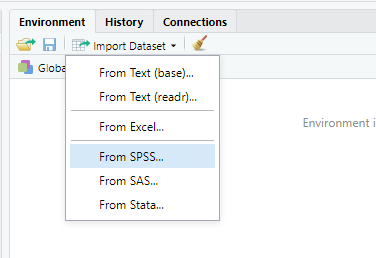

# Väärtuste tüübid

Nagu eelmises peatükis öeldud, siis vektori väärtused peavad olema kõik ühte tüüpi. R-is on väärtuste põhitüübid:

* `int` / `integer` -- täisarvud (ka negatiivsed)
* `numeric` -- reaalarvud
* `cplx` / `complex` -- kompleksarvud
* `char` / `character` -- sõned (tähemärgid ja muud tekstilised sümbolid, sisestamisel kasutada jutumärke)
* `logical` -- tõeväärtused (ainult kaks väärtust: `TRUE` või `FALSE`)
* `Factor` -- faktortunnus   Faktor on tegelikult mingi andmestruktuur aga meie jaoks hetkel oluline

Üht tüüpi väärtust saab  vahel teisendada teist tüüpi väärtuseks vastava `as.<tüübi_nimi>` käsuga (`as.integer`, `as.numeric`, `as.character` jne). Kontrollimaks mingi väärtuse tüüpi saab kasutada vastavat käsku `is.<tüübi_nimi>` (`is.integer`, `is.numeric`, `is.character` jne).


## Väärtuste tüübi kontroll ja muutmine

Eelmises peatükis moodustasime mõned vektorid.
```{r}
kaalud <- c(73, 85, 92.3, 62, 103.2, 70.2)
nimed <- c("Liisa", "Margus", "Mati", "Maria", "Tauno", "Heleri")
vanused <- c(37, NA, 23, 53, 53, 45)
```
ja kontrollime nende väärtuste tüüpe:
```{r} 
is.integer(kaalud)
is.numeric(kaalud)
class(nimed)
class(vanused)
```
Eraldi käsk on ka puuduvate väärtuste esinemise kontrolliks:
```{r}
is.na(vanused)
```
```{r include=FALSE}
anyNA(vanused)
```


### Ülesanded

1. Kas tekstiväärtused saab teisendada arvudeks? Kontrolli vektori `x <- c(0:5,  "tekst", "T", 234.5, "234,5")` korral, kas need on tekstivektorid st kasuta funktsiooni `is.character(.)`. Seejärel vaata, mis on tulemuseks kui rakendad funktsiooni `as.numeric(.)` sellele vektoritele. 
2. Rakenda funktsiooni `is.na(.)` vektorile  `z <- c("a", "NA", NA, 0)`. Kas tulemus on oodatav?


```{r, eval = F, echo = F}
# 1
x <- c(0:5,  "tekst", "T", 234.5, "234,5")
is.character(x)
as.numeric(x)

# 2
z <- c("a", "NA", NA, 0)

is.na(z)
```


## Tõeväärtused ja tõeväärtusvektorid

Kui käsuga `mean` kasutada argumenti `na.rm`, siis selle argumendi väärtus võib olla `TRUE` või `FALSE`. Tegemist on **tõeväärtustega**. Kuna tõeväärtustega saab teha **loogilisi tehteid** (ehk neid kombineerida), siis on neist kasu ka mujal kui `na.rm` argumendi väärtustamisel. 


Loogilisi tehteid on kolm: korrutamine (`&`), liitmine (`|`) ja eitus (`!`). 

tehe           |  tulemus
---------------------------|---------------
TRUE \& TRUE   |  TRUE
TRUE \& FALSE  |  FALSE
FALSE \& TRUE  |  FALSE
FALSE \& FALSE |  FALSE
---------------------------|---------------
TRUE \| TRUE   |  TRUE
TRUE \| FALSE  |  TRUE
FALSE \| TRUE  |  TRUE
FALSE \| FALSE |  FALSE
---------------------------|---------------
!TRUE          |  FALSE
!FALSE         |  TRUE

Tõeväärtus on tulemuseks siis, kui võrdleme kahte objekti/väärtust omavahel.

võrdlus        | sümbol        |  näide   
---------------|---------------|----------------
võrdumine      |  `==`         |  `2 == 3` ; `"a" == "A"`
mittevõrdumine |  `!=`         | `2 != 3` ; `"a" != "A"`
väiksem kui    |  `<`          | `2 < 3` ; `"a" < "A"`
väiksem või võrdne | `<=`      | `3 <= 2` ; `"a" <= "A"`
suurem kui     |  `>`          | `3 > 2` ; `"a" > "A"`
suurem või võrdne | `>=`       | `3 >= 2` ; `"a" >= "A"`

Nagu ennist mainitud, siis R-is tehakse tehteid vektoritega elementhaaval. Seepärast ka siis, kui võtame mingi arvulise vektori ja võrdleme seda mingi arvuga, siis võrreldakse igat elementi eraldi ja tulemuseks on tõeväärtustest koosnev vektor, milles on sama palju elemente kui oli elemendiviisilisi võrdluseid. Sama kehtib ka juhul, kui võrreldakse muud tüüpi väärtuseid (näiteks tekstilisi väärtuseid). 

```{r, eval=F}
kaalud > 80
vanused == 53
nimed == "Mati"
vanused == kaalud
nimed == "Mati" | nimed == "Maria"
```

Kui soovime mingit väärtust võrrelda `NA`-ga, et teada saada, kas tegemist on puuduva väärtusega või mitte, siis topeltvõrdusmärgid ei tööta, vaid tuleb kasutada käsku `is.na(.)`
```{r}
vanused == NA
is.na(vanused)
```

Mõnikord on soov kontrollida, kas mingi väärtus leidub etteantud hulgas. Siis on sobilik kasutada operaatorit `%in%` :
```{r}
1:4 %in% c(2, 5)
c(2, 5) %in% 1:4
```

Tõeväärtuste puhul on huvitav see, et kui nendega tavalisi arve korrutada või liita vms, siis konverteeritakse tõeväärtused arvudeks: `TRUE` muutub arvuks 1 ja `FALSE` muutub arvuks 0.
```{r}
is.na(vanused) * 1
sum(is.na(vanused))  # mitmel vaatlusalusel on vanus puudu
```

Konverteerimine toimib automaatselt. Kui on endal soov tõeväärtuseid arvuliseks muuta, saab rakendada käsku `as.numeric(.)` tõeväärtustega vektorile. Saab ka vastupidi: kui on soov arvusid tõeväärtusteks muuta, saab seda teha käsuga `as.logical(.)`. Proovi!

### Ülesanded

1. Proovi läbi järgmised käsud `as.integer(c("tere", 0, 1, TRUE, FALSE))` ja `as.integer(c(0, 1, TRUE, FALSE))`  ning mõtle, miks väärtused `TRUE` ja `FALSE` teisendatakse neil juhtudel erinevalt.
```{r, eval = F, echo = F, results='hide'}
as.integer(c("tere", 0, 1, TRUE, FALSE))
as.integer(c(0, 1, TRUE, FALSE))
```


# Andmestik, andmete import

Tavaliselt koosnevad andmestikud ridadest ja veergudest (tulpadest), kus iga rida vastab mingile mõõtmisobjektile ja iga veerg vastab mingile mõõdetud omadusele (tunnusele). 

```{r, echo = F,  fig.width = 5}
vanused <- c(7, NA, 3, 53, 53, 95)
kaalud <- c(7, 3.5, 0.4, 2, 3.2, 20.2)
liik <- c("koer", "kass", "rott", "kass", "kass", "koer")
D <- data.frame(liik, kaalud, vanused)


par(cex = 0.9, mar = c(0, 0, 0, 0))
plot(c(-1, 10), c(1, 12), type = "n", axes = F, xlab = "", ylab = "", xlim = c(0, 5), ylim = c(3, 11))
x <- c(2, 3, 4)
y <- seq(9, 2, -0.75)


for (i in 1:6){
  for(j in 1:3)
text(x[j], y[i+2], D[i, j], adj = c(0.5, 0.5))
  }

for (i in 1:8)
lines(c(1.5, 4.5), rep(mean(y[c(i, i+1)]), 2), col = "gray")

rect(1.5, mean(y[8:9]), 4.5, mean(y[1:2]), border = 1, lwd = 2)
rect(1.5,  mean(y[1:2]), 4.5, mean(y[2:3]), border = 1, lwd = 2, col = "gray")

for(j in 1:3) text(x[j], y[2], names(D)[j], adj = c(0.5, 0.5), font=2)


arrows(0, 6, 1.6, 6, code = 2, angle = 15)
text(1, 6, "rida = objekt", adj = c(1, -1))

arrows(3, 10.5, 3, 8.5, code = 2, angle = 15)
text(3, 9.5, "veerg = tunnus", adj = c(-0.1, -1))


```


Erinevad statistikaprogrammid kasutavad andmestike säilitamiseks eri failiformaate. Et andmestikke ühest programmist teise saada, on üheks võimalikuks lahenduseks andmetabel salvestada vahepeal tekstiformaadis failiks, näiteks `.txt` või `.csv` tüüpi failiks ja importida tekstifail. 

MS Exceli faile ning statistikatarkvarade spetsiifilisi andmeformaate (nt Stata `.dta`, SPSS-i, `.sav`) saab R-i importida RStudio mugavalt importida **Import Dataset** akna abil.  




## Töökausta seadistamine

Andmestike importimisel ja tulemuste väljastamisel on hea toimetada ühes ja samas kaustas - nn **töökaustas**. Käsu `setwd` abil saab määrata, milline on käimasoleva töösessiooni töökaust, ja kui andmefail on selles kataloogis, siis piisab nt käsule `read.table` faili nime etteandmisest (täispikka asukohta ei pea andma). 

**NB!** Windowsis on kombeks kaustastruktuuri tähistamiseks kasutada kurakaldkriipsu (tagurpidi kaldkriipsu) `\`, aga R-is on sellisel kaldkriipsul eriline tähendus -- sellega märgitakse, et järgneb erisümbol (nt `\t` on tabulaatori sümbol). Seepärast tuleb kataloogitee märkimisel kasutada kahekordseid kurakaldkriipse, näiteks:
```{r,eval=FALSE}
setwd("C:\\Users\\mina\\Rkoolitus\\")
```
Teine võimalus on kasutada tavalist kaldkriipsu, nagu MacOS-is ja Linuxites:
```{r,eval=FALSE}
setwd("C:/Users/mina/Rkoolitus/")
```

Töökeskkonnas olevaid andmetabeleid saab faili kirjutada nt käsuga `write.csv2(.)`, andes käsule ette salvestatava andmestiku nime ning loodava faili nime jutumärkides (vajaduse korral koos kataloogiteega):
```{r, eval = F}
write.csv2(näide1, "failinimi.txt", row.names = F)
```


## Esmase ülevaate saamine andmetabelist

Sisse loetud andmestik on erilist tüüpi, **`data.frame`**-tüüpi objekt. Andmestikust saab kiire ülevaate järgmiste käskudega:


---------------   -----   ------------------------------------------------------------------------------------------------
`nrow(andmed)`      -     mitu rida on andmestikus
`ncol(andmed)`      -     mitu veergu on andmestikus
`dim(andmed)`       -     mitu rida ja mitu veergu on andmestikus
`str(andmed)`       -     andmestiku struktuur: mis tüüpi iga tunnus on ja  esimesed väärtused
`summary(andmed)`   -     lühike kirjeldav statistika iga tunnuse kohta
`names(andmed)`     -     veergude nimed
`head(andmed)`      -     andmestiku mõned esimesed read
---------------   -----   ------------------------------------------------------------------------------------------------

Impordime ühe andmestiku ja vaatame andmestikust ülevaadet
```{r, results='hide'}
load(url("https://github.com/Rkursus/kantaremor/raw/main/data/andmed.RData"))
summary(andmed)
str(andmed)

```

Käsu `summary(.)` puhul on näha, et mõne tunnuse puhul arvutatakse keskmine, miinimum, maksimum jne, aga teise tunnuse puhul esitatakse sagedused. See, millist kirjeldusviisi kasutatakse, tuleneb tunnuse tüübist. Kui käsuga `str(.)` vaadata, mis on tunnuste tüübid selles andmestikus, on näha kolme tüüpi tunnuseid: `int`, `num` ja `Factor`. On näha, et `summary(.)` käsk arvutab `int`-tüüpi tunnustele keskmisi jne, `Factor`-tüüpi (ja ka `chr`-tüüpi) tunnustele aga on antud vaatluste arv ja tüübinimi. Faktortüüpi tunnus sarnaneb sõnele (*character*), kuid üheks erinevuseks on näiteks fikseeritud väärtuste hulk.


# Toimingud andmestikuga

Jätkame eelmises punktis kasutatud andmestikuga.

## Veergude ja ridade eraldamine andmestikust: indeksi ja nime järgi

Kui tahame andmestikust ainult üht veergu uurida, siis kõige mugavam on kasutada dollari-sümbolit:
```{r, eval=FALSE}
vanused <- andmed$vanus
median(andmed$vanus)
median(vanused)
```

Üldiselt on `data.frame` kahemõõtmeline tabel, mis tähendab, et iga elemendi asukoht selles tabelis on ära määratud rea ja veeru numbriga. Rea- ja veerunumbrite abil andmestikust infot eraldades tuleb kasutada kantsulgusid:
```{r,eval=FALSE}
andmed[3, 2]  # kolmas rida, teine veerg
andmed[ , 2]  # kogu teine veerg
andmed[3,  ]  # kogu kolmas rida
```

Korraga on võimalik eraldada ka mitut rida või veergu, kasutades selleks käsku `c(.)`:
```{r,eval=FALSE}
andmed[, c(2, 4)]  # teine ja neljas veerg
valik <- c(2, 4)  # tekitame objekti, milles on kirjas huvipakkuvate veergude numbrid
andmed[, valik]  # kasutame seda objekti andmestikust veergude eraldamiseks
andmed[c(5, 3,  9), ]  # viies, kolmas ja üheksas rida
```

Tihti on veeruindeksite asemel mugavam kasutada veergude nimesid (peavad olema jutumärkides):
```{r,eval=FALSE}
andmed[, c("vanus", "pikkus")]  # eraldame veerud "vanus" ja "pikkus"
```


## Uue tunnuse lisamine

Uue tunnuse lisamiseks andmestikku tuleb valida tunnuse nimi, mida andmestikus veel ei esine, ja omistada uuele andmeveerule valitud väärtused. Lisame oma andmestikku näiteks pikkuse teises mõõtühikus, mis on arvutatud olemasoleva pikkuse tunnuse `pikkus` abil. Uus tunnus lisatakse viimaseks veeruks andmestikus:
```{r,eval=FALSE}
andmed$pikkus_meetrites <- andmed$pikkus/100
str(andmed)
```


## Veergude ja ridade eraldamine andmestikust: tõeväärtusvektori abil

Tõeväärtusvektoreid on väga mugav kasutada nn filtritena. Nimelt on `data.frame` puhul võimalik ridu (ja ka veerge!) eraldada mitte ainult indeksi või -nime järgi, vaid ka tõeväärtusvektori abil. Kui eraldada ridu, siis vastav tõeväärtusvektor peab olema sama pikk kui on andmestikus ridu ning  väärtused selles vektoris näitavad, kas vastavat rida kasutada (`TRUE`) või mitte (`FALSE`). Tõeväärtusvektorite kombineerimisel saab andmestikust väga spetsiifilisi alamhulki eraldada.

```{r}
# eraldame kõik read, kus sugu == 2 (Mees) ning salvestame selle uueks objektiks
mehed <- andmed[andmed$sugu == "2", ]

# moodustame kaks filtritunnust ja kombineerime need alagrupi valikuks
filter_tervis <- andmed$tervis == "väga hea"  # väga hea tervisega
filter_vanus <- andmed$vanus >= 23                        # vähemalt 23 aastased
alamandmestik <- andmed[filter_tervis & filter_vanus, ]   # Ära unusta: [read, veerud]
```


### Ülesanded

1. Moodusta alamandmestik, kuhu kuuluvad uuritavad, kellel puudub vererõhu mõõtmistulemus (tunnus `SVR` - süstoolne vererõhk).


 
